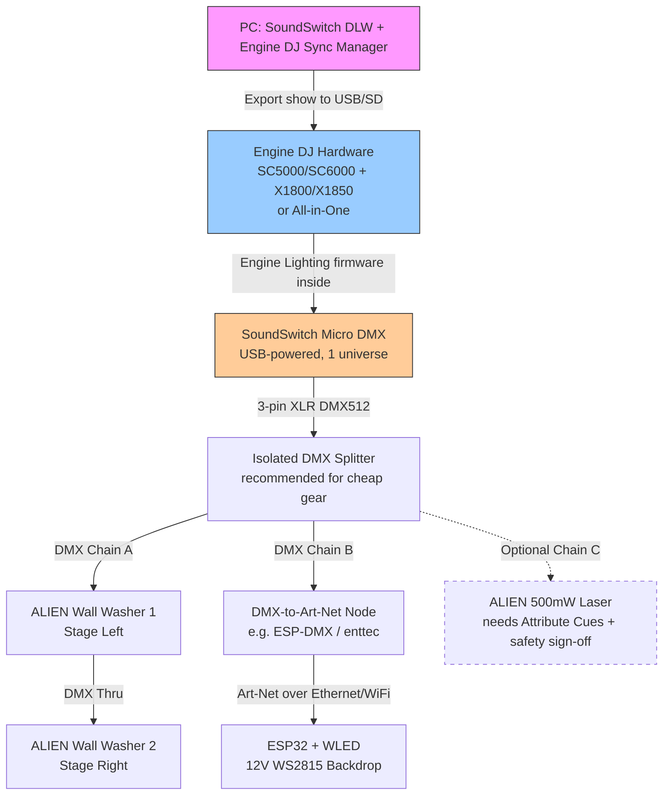

# Rave Cave: Weekend DJ-Synced Lighting Build

**Goal:** Build a beat-synced lighting rig in one weekend that plugs into Engine DJ decks and drives cheap AliExpress DMX fixtures plus an ESP32 LED backdrop. All synced via Engine Lighting (SoundSwitch firmware inside Engine OS). This is for Jonathan Clark's Sydney show—parts on the table Friday night, coded and tested by Sunday arvo.

---

## Architecture Diagram

---

## Protocol Map

| From | To | Protocol | Notes |
|------|-----|----------|-------|
| PC | Deck | USB export | SoundSwitch DLW + Engine DJ Sync Manager → USB/SD card |
| Deck (Engine Lighting) | Micro DMX | USB (VID/PID locked) | **Must be SoundSwitch-branded hardware**. Generic USB-DMX dongles do NOT work. |
| Micro DMX | Fixtures | DMX512 (3-pin XLR) | 1 universe, ~37–40 Hz refresh |
| Micro DMX | DMX Splitter | DMX512 | Isolated splitter protects against shit AliExpress optos |
| DMX Splitter | Wall Washers | DMX512 daisy-chain | Start addresses set via DIP switches or menu |
| DMX Splitter | DMX→Art-Net Node | DMX512 → Art-Net | Reliable path; **sACN/E1.31 NOT supported by Engine Lighting** |
| Art-Net Node | ESP32 WLED | Art-Net (UDP unicast) | WLED 0.14+ with ArtPoll enabled; whole strip = 1 DRGB fixture |
| Engine Lighting | WLED (direct) | Art-Net **FLAKY** | ArtPoll/ArtPollReply often breaks; APIPA 169.254.x.x sometimes works, classic 2.x.x.x often doesn't. **Do not rely on this for weekend v1.** |

**Hard constraint:** Engine Lighting **only** works with SoundSwitch-branded USB-DMX (Micro DMX or Control One). Source: [Engine DJ Support](https://support.enginedj.com/support/solutions/articles/69000793758)

---

## Buy List v1

### **MUST BUY (Show-Critical Path)**

| Item | Why | AU Price | Link | Notes |
|------|-----|----------|------|-------|
| **SoundSwitch Micro DMX** | Only USB-DMX that works with Engine Lighting | ~AU$64 | [Bashs Music](https://www.bashsmusic.com.au/product/soundswitch-usb-to-dmx-lighting-interface/) / [DJ City](https://djcity.com.au/product/soundswitch-2-micro-dmx-interface-micro-usb-to-dmx-xlr-lighting-interface/) | **Often on backorder.** Check stock NOW. 1 universe, USB-powered. Trial SoundSwitch licence included; then US$7.99/mo, $79.99/yr, or $199.99 perpetual. |
| **ALIEN DMX512 LED Wall Washer (×2)** | Cheap, real DMX, RGB colour wash | ~AU$56 each | AliExpress (see images) | Screenshot showed Brazil plug selected; AU plug looked greyed out. **Confirm 3-pin XLR DMX in/out in product photos**, not just "DMX512" in title for auto/sound modes. |
| **AU 240V power solution for wall washers** | AliExpress gear ships with wrong plugs | TBD | Local hardware / Jaycar | IEC C13/C14 leads + AU plug adapters, or rewire. Check washer input: IEC vs hardwired. |
| **12V WS2815 / SK6813HV LED strip (5m, 60 LED/m)** | Dual-data, 12V = less voltage drop for multi-metre backdrop | AU$111.97 (local) or ~US$50 (Ali) | [K&A Electronics SK6813HV IP68](https://kandaelectronics.com.au/products/rgb-addressible-led-strip-sk6815-ws2815-60-leds-per-meter-dc-12v-ip68) (in stock) | ~40mA/LED full white = 2.4A/m. Size PSU for worst-case. Cheaper BTF/Ali rolls exist if shipping allows. |
| **ESP32 DevKit (WROOM or similar)** | Runs WLED; 3.3V GPIO needs level shift to 5V data | ~AU$10–15 | Core Electronics, AliExpress | WROOM is fine. WT32-ETH01 if you want Ethernet for Art-Net reliability instead of WiFi. |
| **12V PSU for LED strip** | Calculate 2.4A/m × strip length + 20% headroom | TBD | Jaycar, local 12V bricks | Example: 5m = 12A; use 15A+ PSU. Fuse it. |
| **5V level shifter (3.3V → 5V)** | WS2815 data line needs 5V; ESP32 GPIO is 3.3V | ~AU$5 | 74HCT245 or 74AHCT125 | Or a single 74HCT245 chip + breadboard. Don't skip this or you'll get flicker/dropouts. |
| **DMX-to-Art-Net node** | Reliable path from Micro DMX → WLED | ~AU$50–200 | Enttec ODE Mk2 ~AU$189 [DJ City](https://djcity.com.au/product/enttec-ode-mk2-ethernet-to-dmx-interface/), or ESP-DMX DIY | Weekend-safe: buy the Enttec. DIY ESP-DMX if you're keen and have time. |
| **Isolated DMX splitter (1→4 or 1→8)** | Protects against cheap AliExpress opto isolation failures | ~AU$80–150 | ADJ, Chauvet, or generic | Optional but **highly recommended** for cheap Ali gear. Alternatively: separate PSU per fixture = some isolation. |
| **3-pin XLR DMX cables (×3–5)** | Daisy-chain DMX | ~AU$10–20 each | Jaycar, DJ City | 3-pin (not 5-pin). 3m+ per cable for stage spread. |
| **Power injection / terminal blocks** | Every 3–5m on long LED runs | ~AU$10 | Jaycar | Stranded copper, solder/screw terminals, heatshrink. |

### **SKIP / WRONG PROTOCOL**

| Item | Why Skip |
|------|----------|
| **Smart RGB CCT Floor Lamps (103cm, 5V USB, Bluetooth/IR, ~AU$20)** | **Not DMX.** They're Bluetooth/IR app-controlled. Engine Lighting can't talk to them. If Jonathan already owns a pair, they can be a later IR relay side-quest or strip a WS2815 segment for hacking, but **not v1 show-critical**. Park them. |

### **OPTIONAL / LATER (Not Weekend v1)**

| Item | Why Later | AU Price | Notes |
|------|-----------|----------|-------|
| **ALIEN 500mW RGB Laser** | DMX-compatible BUT: (1) needs Attribute Cues in SoundSwitch (gobo/pattern mode, not RGB PAR autoscript), (2) if 500mW is real → Class 4 → AU entertainment use typically requires laser safety officer sign-off, (3) cheap Ali lasers often have weird DMX maps → custom Fixture Profile pain. | ~AU$56 | Same AU plug issue. **Protocol ≠ legal to fire in a room.** If you want aerials/wall patterns and understand AU laser safety, build Attribute Cues. Otherwise, skip for weekend v1. |
| **SoundSwitch Control One** | 2 universes, DMX IN merge, pad integration | ~AU$429 ([DJ City](https://djcity.com.au/product/soundswitch-control-one/), in stock) | Overkill unless you want 2 universes + pads. It **replaces** Micro DMX (still needs the same SoundSwitch licence). Stick with Micro DMX for v1. |

---

## Power, Plugs, and Cabling

### **Power Budget**

| Device | Power Draw | Source |
|--------|------------|--------|
| SoundSwitch Micro DMX | USB bus-powered (~500mA) | Deck USB or mixer USB hub |
| ALIEN Wall Washer (each) | ~30–50W (guess; check manual) | AU 240V mains |
| WS2815 LED strip (5m, 60 LED/m, full white) | ~12A @ 12V = 144W | 12V PSU (size 15A+ for headroom) |
| ESP32 DevKit | ~500mA @ 5V (via USB or separate 5V rail) | USB power brick or buck from 12V |
| DMX splitter (if powered) | ~5–10W | AU 240V mains or 12V DC |
| Art-Net node (Enttec ODE Mk2) | ~5W | USB or 5V DC |

### **Mains / Plugs**

- **ALIEN fixtures:** AliExpress screenshot showed Brazil plug. AU plug looked unavailable. Options:
  1. Check if input is IEC C13 (kettle lead) → buy AU IEC leads locally.
  2. If hardwired → rewire with AU plug or use travel adapter (not ideal for permanent rig).
- **DMX splitter / Art-Net node:** Check AU 240V vs 12V DC input. Most touring-grade splitters are IEC.

### **Cabling Lengths**

- **DMX XLR:** 3m+ per cable for stage spread. Budget 3–5 cables (splitter → washer 1 → washer 2, splitter → node, splitter → laser if later).
- **LED strip:** 5m is one roll. Power injection every 3–5m (two injection points for 5m if running full white). Run heavy gauge (14–16 AWG stranded copper) from PSU to strip ends and middle.

---

## Weekend Build Order

### **Friday Night (Parts Unboxing + Preflight)**

1. **Inventory check:**
   - SoundSwitch Micro DMX in hand?
   - ALIEN wall washers arrived with correct voltage?
   - ESP32 + WS2815 strip + PSU + level shifter?
   - DMX cables, XLR gender correct?
2. **Laptop setup:**
   - Install SoundSwitch DLW (Windows/Mac): https://www.soundswitch.com/download/
   - Install Engine DJ Desktop (Sync Manager): https://enginedj.com/downloads
   - Activate SoundSwitch trial (comes with Micro DMX; 14 days DMX Pro).
3. **Flash WLED to ESP32:**
   - Web installer: https://install.wled.me/
   - Select ESP32, flash latest stable (0.14.x+).
   - Connect to WLED AP, configure WiFi, note IP.
4. **Breadboard test:**
   - Wire ESP32 → 74HCT245 level shifter → short WS2815 segment.
   - WLED web UI: Segments → 60 LEDs, WS281x, GPIO 2 or 16.
   - Test RGB chase. If it works, solder it up properly for Saturday.

### **Saturday (DMX Chain + Fixture Profiles)**

1. **Assemble DMX chain:**
   - Micro DMX (plugged into laptop USB for testing) → DMX splitter (if using) → Wall Washer 1 → Wall Washer 2.
   - Set DMX start addresses on washers (DIP switches or menu): e.g. Ch 1, Ch 11 (assuming 8–10 channels each; check manual).
2. **Build Fixture Profiles in SoundSwitch:**
   - Open SoundSwitch DLW → Fixture Manager.
   - If ALIEN washers aren't in library: create custom profile from manual (PDF DMX chart).
   - Email support@soundswitch.com if stuck; they accept PDF manuals.
   - Patch fixtures: Universe 1, Ch 1 (Washer 1), Ch 11 (Washer 2).
3. **Autoscript test:**
   - Import a track into SoundSwitch DLW.
   - Run Autoscript (beat-sync engine).
   - Preview: washers should strobe/colour-change on kicks.
4. **Export + deck test (if deck available):**
   - Engine DJ Sync Manager: sync SoundSwitch project to USB/SD.
   - Plug USB into deck (SC5000/SC6000 + X1800/X1850 or all-in-one).
   - Micro DMX plugged into mixer USB hub (for mixer+player setups) or deck USB (all-in-ones).
   - Load track, enable Engine Lighting, watch washers follow the beat.

### **Sunday (LED Backdrop + Art-Net Integration)**

1. **Backdrop physical install:**
   - Mount 5m WS2815 strip on backdrop frame (aluminium channel or gaff tape).
   - Power injection: 12V PSU → strip start AND strip middle (solder/terminal blocks, fuse at PSU).
   - ESP32 + level shifter → data line to strip start.
   - Power ESP32 via USB brick or buck converter from 12V rail.
2. **DMX → Art-Net path:**
   - Enttec ODE Mk2 (or ESP-DMX node): DMX IN from splitter, Ethernet/WiFi to same network as ESP32.
   - Configure node: Input Universe 1 → Output Art-Net Universe 0.
   - WLED: Settings → Sync Interfaces → Art-Net, Universe 0, Enable ArtPoll.
   - Optional: Static IP for WLED (easier to find after reboots).
3. **SoundSwitch Fixture Profile for WLED:**
   - Library fixture: "Wled- ESP8266DMX (Chn = 4)" Single DRGB.
   - **Note:** Whole strip is treated as ONE fat RGB fixture. SoundSwitch won't do per-pixel mapping; it sends R/G/B/Dim for the whole strip. WLED will light all 300 LEDs the same colour. If you want chases/patterns, WLED's internal FX engine can take over (but not synced via SoundSwitch). For weekend v1: accept single-colour backdrop sync.
   - Patch WLED: Universe 1, Ch 21 (or wherever you have space).
4. **Full-rig run-through:**
   - Play a track on the deck with Engine Lighting enabled.
   - Confirm: Washers + backdrop all change colour/strobe on beat.
   - If Art-Net is flaky (WLED not responding), check:
     - Same L2 network (router, not separate VLANs).
     - APIPA fallback: Node 169.254.x.x, ESP32 169.254.y.y (sometimes more reliable than classic 2.x.x.x).
     - Node unicast ArtDmx to WLED IP (not broadcast).
5. **Backup DMX-in mode (if Art-Net fails):**
   - ESP32 with MAX485 RS-485 transceiver → DMX IN from splitter.
   - WLED firmware supports DMX input (Settings → DMX Input, start address).
   - This is more hardware (MAX485 chip) but 100% reliable if Art-Net is being a bastard.

---

## Software Stack

### **On PC (Show Authoring)**

1. **SoundSwitch DLW (Desktop Lighting Workflow):**
   - Download: https://www.soundswitch.com/download/
   - Build lightshow: import tracks, run Autoscript (AI beat-sync), tweak cues.
   - Fixture Manager: patch DMX fixtures (ALIEN washers, WLED).
   - Export project.
2. **Engine DJ Desktop (Sync Manager):**
   - Download: https://enginedj.com/downloads
   - Import SoundSwitch project → sync to USB/SD card for deck playback.

### **On Engine DJ Deck (Show Playback)**

- **Engine Lighting firmware** (inside Engine OS): reads SoundSwitch project from USB/SD, drives Micro DMX in real-time during performance.
- **Hardware:** SC5000/SC6000 players + X1800/X1850 mixer (Micro DMX plugs into mixer USB hub) OR SC Live / Prime Go / Prime 4 all-in-one (Micro DMX plugs into deck USB).

### **On ESP32 (LED Backdrop)**

- **WLED 0.14.x+:**
  - Flash via https://install.wled.me/ (easiest) or ESPHome/PlatformIO.
  - Web UI config:
    - WiFi: join local network (same as Art-Net node).
    - LED Settings: GPIO pin (2 or 16), 300 LEDs (5m × 60/m), type WS281x.
    - Sync Interfaces: Art-Net enabled, Universe 0, Start Address 1, **ArtPoll enabled** (required for SoundSwitch discovery).
  - **Do NOT write custom firmware.** WLED does Art-Net + DMX input + web UI + effects out of the box.

### **Fixture Profiles**

- **ALIEN Wall Washer:** Check AliExpress listing or email seller for DMX channel map PDF. If not in SoundSwitch library, build custom profile (Fixture Manager → New → map RGB/Dimmer/Strobe/Mode channels).
- **WLED:** Use library fixture "Wled- ESP8266DMX (Chn = 4)" Single DRGB. 4 channels: R, G, B, Dimmer. Entire strip = 1 fixture. For per-pixel (170 pixels = 510 DMX channels = whole universe as Multi-RGB), you'd need a different workflow (SoundSwitch may not support it elegantly; treat as future upgrade).

---

## Risks

| Risk | Impact | Mitigation |
|------|--------|------------|
| **SoundSwitch Micro DMX stock** | High: it's the only USB-DMX that works; often backorder | Check [Bashs Music](https://www.bashsmusic.com.au/product/soundswitch-usb-to-dmx-lighting-interface/) and [DJ City](https://djcity.com.au/product/soundswitch-2-micro-dmx-interface-micro-usb-to-dmx-xlr-lighting-interface/) stock NOW. Order immediately. If out of stock, check SoundSwitch direct or Control One as backup (AU$429, overkill but in stock). |
| **AliExpress shipping time** | High: show date unknown; Ali can be 2–6 weeks | Order ALIEN fixtures TODAY. Fall back to local K&A LED strip (in stock, AU$112) for backdrop. If Ali won't arrive, rent local DMX PARs (more expensive, but stock is guaranteed). |
| **ALIEN fixtures have fake DMX** | Medium: "DMX512" in title may mean auto/sound modes, not real 3-pin XLR | Zoom into product photos: confirm 3-pin XLR IN/OUT sockets. Read reviews. Worst case: they're sound-activated crap; return and buy local Chauvet/ADJ. |
| **AU plug compatibility** | Medium: Brazil plug in screenshot, AU greyed out | Check if fixtures have IEC input (buy AU IEC leads). Otherwise: rewire with AU plug (if comfortable) or quality travel adapter (not long-term). |
| **Art-Net from Engine Lighting flaky** | Medium: ArtPoll/ArtPollReply often fails; classic 2.x.x.x routing breaks | **Weekend path: DMX splitter → Enttec ODE Mk2 DMX-to-Art-Net node → WLED.** Don't rely on direct deck-to-WLED Art-Net. APIPA 169.254.x.x sometimes works; try it as backup. |
| **sACN not supported** | Low: corrected in research | Plan confirmed: DMX + Art-Net only. Do NOT buy sACN-only nodes. |
| **WLED treated as single DRGB, not per-pixel** | Low: SoundSwitch sees strip as 1 fat RGB fixture | Accept it for v1. Whole strip changes colour together. For per-pixel chases, WLED's internal FX can run (but not beat-synced via SoundSwitch). Future: custom DMX Multi-RGB personality (170 LEDs = 510 DMX channels; may exceed SoundSwitch 1-universe workflow). |
| **Laser (500mW RGB) is Class 4** | **HIGH: illegal to operate without safety officer in AU entertainment** | If Jonathan wants the laser: (1) confirm it's <5mW (unlikely given Ali title), (2) check AU regulations (WorkSafe NSW if in Sydney), (3) aerial/wall patterns only (no audience scanning), (4) build Attribute Cues (not RGB PAR autoscript). **Skip for weekend v1 unless laser-safe and legally covered.** |
| **SoundSwitch licence cost** | Low: trial included, then ongoing cost | Micro DMX includes 14-day trial. After: US$7.99/mo, $79.99/yr, or $199.99 perpetual 2.x. Budget it. Basic mode (Hue/Nanoleaf) is free but **no DMX**. |
| **Cheap AliExpress opto isolation** | Medium: DMX chain failures, ground loops | Buy isolated DMX splitter (ADJ/Chauvet, AU$80–150) OR separate PSU per fixture (some isolation). Test early; if washers glitch, add splitter. |
| **12V PSU undersized for LED strip** | Medium: voltage drop, colour shift, fire risk | Calculate: 5m × 60 LED/m × 40mA = 12A full white. Use 15A+ PSU. Power injection at start + middle. Fuse at PSU. Don't cheap out. |

---

## Open Questions for Jonathan

| Question | Why It Matters |
|----------|----------------|
| **Show date?** | AliExpress shipping is 2–6 weeks. If show is <3 weeks out, order NOW or pivot to local stock (more expensive). |
| **Indoor or outdoor?** | WS2815 IP rating (IP30 vs IP65 vs IP68). K&A link is IP68 (waterproof). If indoor, IP30 is cheaper. |
| **Backdrop dimensions?** | How many metres of LED strip? 5m roll = 300 LEDs. For a 3m wide × 2m tall backdrop, you might need 10m (two rolls). PSU sizing scales with length. |
| **Already own Micro DMX or Control One?** | If yes, skip the AU$64 purchase. If no, buy NOW (stock is flaky). |
| **Already own deck + mixer with Engine Lighting?** | Confirm SC5000/SC6000 + X1800/X1850 or Prime 4/SC Live. If not, this plan is dead (Engine Lighting requires Engine DJ hardware). |
| **How many wall washers?** | Two (stage left/right) is the plan. More? Budget AU$56 × qty + DMX channels. |
| **Laser safety training?** | If you want the ALIEN laser, do you have a laser safety officer or WorkSafe approval? If no, skip it. |
| **WiFi or Ethernet for Art-Net?** | ESP32 DevKit = WiFi. WT32-ETH01 = Ethernet (more reliable for Art-Net, AU$15–20). Enttec ODE Mk2 has Ethernet. If venue WiFi is shit, go Ethernet. |

---

## References

- **Engine Lighting official:** https://enginedj.com/enginelighting
- **SoundSwitch-branded USB required:** https://support.enginedj.com/support/solutions/articles/69000793758
- **SoundSwitch DLW download:** https://www.soundswitch.com/download/
- **WLED install:** https://install.wled.me/
- **K&A Electronics SK6813HV strip (AU, in stock):** https://kandaelectronics.com.au/products/rgb-addressible-led-strip-sk6815-ws2815-60-leds-per-meter-dc-12v-ip68
- **Bashs Music Micro DMX:** https://www.bashsmusic.com.au/product/soundswitch-usb-to-dmx-lighting-interface/
- **DJ City Micro DMX:** https://djcity.com.au/product/soundswitch-2-micro-dmx-interface-micro-usb-to-dmx-xlr-lighting-interface/
- **DJ City Control One:** https://djcity.com.au/product/soundswitch-control-one/
- **DJ City Enttec ODE Mk2:** https://djcity.com.au/product/enttec-ode-mk2-ethernet-to-dmx-interface/

---

**Done when:** Parts are ordered, Micro DMX is in hand, washers + backdrop light up on beat sync with the decks by Sunday night. Mate, it's a weekend build—keep it tight, test early, and don't add more shit than you can wire in 48 hours.
