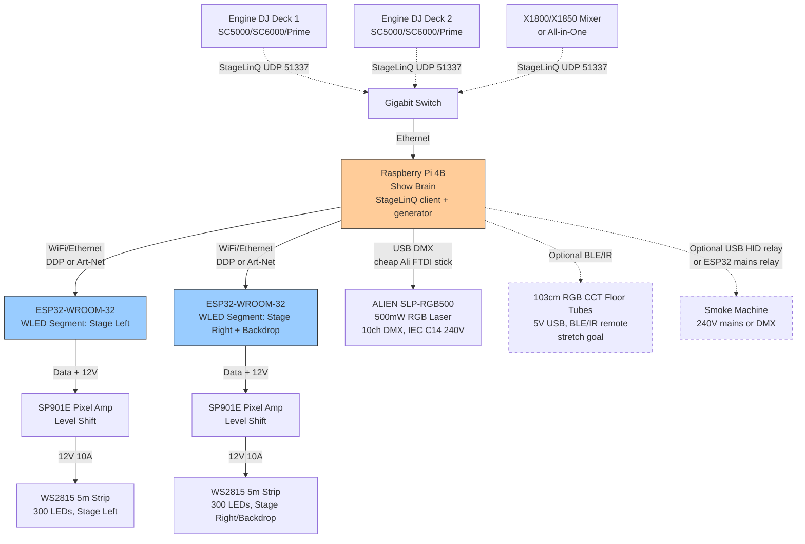

# Rave Cave: Generative DJ-Synced Lighting (Pi 4B + StageLinQ)

**Goal:** Build a beat-synced lighting rig in one weekend that pulls live data from Engine DJ decks via StageLinQ and drives generative lighting code on a Raspberry Pi 4B. Outputs: ESP32 WLED pixel strips (stage left/right/backdrop), cheap USB-DMX laser, optional BLE tubes, optional smoke relay. MAX open data, NOT proprietary fixture puppets. This is for Jonathan Clark's Sydney show—vibe-coded with friends, parts on the table Friday night, live by Sunday.

---

## Architecture Diagram



---

## Why Not SoundSwitch / Micro DMX?

**Jonathan wants MAX open data and generative code, NOT proprietary fixture puppets.**

SoundSwitch path problems:
- **Closed ecosystem:** Micro DMX + SoundSwitch Pro licence (US$7.99/mo, $79.99/yr, $199.99 perpetual) required for DMX. Basic mode is Hue/Nanoleaf only.
- **Fixture Profiles = puppet mode:** You patch RGB PARs at DMX addresses and SoundSwitch autoscript writes canned cues. Lasers need Attribute Cues (gobo/pattern mode). You're puppeting fixtures, not generating from data.
- **No raw BPM / beat / waveform API:** SoundSwitch DLW runs on a PC, exports a baked project to the deck. You can't live-code against StageLinQ waveforms or infer drops in a Python script during the show.
- **VID/PID locked USB:** Only SoundSwitch-branded hardware works (Micro DMX, Control One). Can't plug a cheap Ali USB-DMX into the deck and script it.

**Pi 4B + StageLinQ path:**
- **Open protocol:** StageLinQ is reverse-engineered (https://github.com/chrisle/StageLinq). Engine DJ decks broadcast StateMap (play state, BPM, pitch, faders, crossfader, hotcues, loops), BeatInfo (realtime beat position, total beats), FileTransfer (3-band waveform blobs, beat grid, artwork). UDP 51337 discovery, TCP JSON/binary.
- **Generative code:** Pull BPM, beat-in-bar, fader positions, crossfader L/R, 3-band waveform energy. Write Python/Node/Rust to map that to WLED segments (L/R chases, brightness from faders, drop detection from waveform spikes) and DMX laser patterns. Vibe-code it on Saturday.
- **Cheap USB-DMX on the Pi:** Ali FT232-based USB-DMX is fine on Pi Linux (QLC+ or Python pyusb/pyserial). Engine DJ decks reject cheap dongles, but the Pi doesn't care.
- **WLED is pixels, not RGB PARs:** DDP/Art-Net from the Pi can address every LED in a strip (300 LEDs = 900 DMX channels as RGB, or 1200 as RGBW). SoundSwitch treats WLED as "1 DRGB fixture" (whole strip same colour). Here you get per-pixel chases.

**Trade-off:** You write the generator yourself. No autoscript. That's the point.

---

## StageLinQ Data Map

### What We Get (Protocol Layers)

| Layer | Content | Format | Use Case |
|-------|---------|--------|----------|
| **Discovery** | Device announce (deck, mixer) | UDP 51337 broadcast, JSON | Find devices on LAN, get IP + port for TCP |
| **StateMap** | Track title/artist/path, play state, pitch, BPM, master/sync flag, faders (deck volume, filter), crossfader, hotcues, loops, deck assignment | TCP JSON stream | Live mix state: is deck playing? BPM? Fader up? L/R on crossfader? |
| **BeatInfo** | Realtime beat position (0.0–1.0 within bar), total beats played, current BPM (including pitch bend) | TCP JSON stream | Trigger on beat 1, chase across 4 beats, pulse on every kick |
| **FileTransfer / DB** | Waveform overview (3-band zlib blobs: low/mid/high frequency energy per time slice), beat grid (quantized beats), track artwork, performance data (play count, last played) | TCP binary + JSON | Drop detection (spike in mid/high vs baseline), pre-cue next track's energy profile, visual waveform on a screen |

### What We Infer (Not Native Flags)

| Inference | Method | Code Hint |
|-----------|--------|-----------|
| **Drop incoming** | Waveform energy drop → build → spike. Track 3-band mid/high across 8–16 bars; if current bar is <30% of 16-bar avg and next bar spikes to >150%, that's a classic build/drop. | Decompress zlib, parse 3-band blob, sliding window energy avg, threshold trigger 4 beats before spike → flash white + strobe |
| **Deck active** | `play_state == 'playing' && deck_fader > 0.1 && (crossfader left/centre or right/centre depending on deck)` | If Deck A fader > 0 and crossfader left/centre, that deck is audible. Assign WLED segment to that deck's BPM. |
| **Mix transition** | Crossfader moving from L to R (or R to L) over >2 sec while both decks fader > 0 | Blend L/R segment brightness via crossfader position. |
| **Hotcue jump** | StateMap hotcue triggered → beat position resets → resync pixel chases | Re-align chase phase to new beat grid position. |

### Libraries

| Library | Language | Features | Link | Notes |
|---------|----------|----------|------|-------|
| **StageLinq (chrisle)** | TypeScript | Discovery, StateMap, BeatInfo, FileTransfer, waveform decode | https://github.com/chrisle/StageLinq | **Fullest reverse-engineering.** BeatInfo + waveforms. Use this or port to Python. |
| **PyStageLinQ** | Python | Discovery, StateMap only | https://github.com/Jaxc/PyStageLinq | No BeatInfo, no waveforms. Good for quick fader/BPM demo, not enough for drops. |
| **Mixboard** | Electron (TypeScript) | Live dashboard to inspect StageLinQ firehose | https://github.com/LaokeQwQ/Mixboard | Run this Friday night to confirm decks are broadcasting. Great debug tool. |

**Protocol docs:** https://github.com/honusz/stagelinq-js/blob/main/docs/PROTOCOL.md

---

## Hardware Map

### Already Ordered (AliExpress, Sep 2026)

| Item | Qty | Spec | Power | Use |
|------|-----|------|-------|-----|
| **ESP32-WROOM-32 DevKit** | 2 | USB-C, CP2102, dual-core 240 MHz, WiFi | 5V USB (500mA) | WLED endpoints for L/R strips. NOT the brain (that's the Pi). |
| **12V 10A power brick (AU plug)** | 2 | 120W, switch-mode | 240V mains → 12V DC | One per 5m WS2815 roll. Inject both ends. |
| **ALIEN SLP-RGB500 laser** | 1 | 500mW RGB, 10ch DMX, IEC C14 inlet, 100–240V | IEC C13 kettle lead (240V AU mains) | Brazil plug SKU, same unit. Use AU PC power cable. |
| **WS2815 12V 60 LED/m IP67** | 2× 5m | White PCB, 300 LEDs per roll, dual-data line | 12V, ~2.4A/m full white = 12A per 5m | 10m total. 30/m would be easier; 60/m is OK with two bricks + brightness cap. |
| **SP901E pixel amp** | 2 (confirm cart) | 12V input, 5V data output, 2048 px, SPI support | 12V from same brick as strip | Level shift 3.3V ESP32 GPIO → 5V WS2815 data. NOT blue I2C BSS138 modules. |
| **SN74AHCT125N DIP** | Backup | Quad buffer, 5V VCC, 3.3V input tolerant | 5V (NOT 12V) | DIY level shift if SP901E fails. 74AHCT125 VCC = 5V, input = 3.3V ESP32, output = 5V data line. |

### Still Need to Buy

| Item | Why | Approx Price | Where | Notes |
|------|-----|--------------|-------|-------|
| **Cheap USB-DMX (3-pin XLR)** | Laser control from Pi | ~AU$20–40 | AliExpress, eBay | Look for FT232 chipset (FTDI-based, Linux-friendly). "USB to DMX512" 3-pin XLR female out. Avoid CH340 (flaky). |
| **3-pin DMX cable (3m+)** | Pi USB-DMX → laser XLR IN | ~AU$10–15 | Jaycar, DJ City, AliExpress | 3-pin (not 5-pin). Stage-length. |
| **Gigabit switch** (if not owned) | Decks + Pi on one LAN for StageLinQ | ~AU$20–30 | Officeworks, Jaycar | 5-port unmanaged. Only if decks aren't already on a switch/router. |
| **IEC C13 AU kettle lead** | Laser mains power (IEC C14 inlet on laser) | ~AU$5–10 | Jaycar, Officeworks | Standard PC power cable, AU 240V plug. |
| **Spare USB-C cables** | ESP32 power (can use phone chargers) | ~AU$5 | Anywhere | 5V 2A USB bricks (phone chargers OK). |
| **USB HID relay or ESP32 relay** (if smoke is mains-switched only) | Trigger smoke bursts from Pi | ~AU$10–30 | AliExpress | **Mains-rated SSR or relay in an enclosure.** Do NOT switch 240V with toy 5V relay modules. See Risks. |

### Do NOT Buy (Wrong Path / Already Covered)

| Item | Why Skip |
|------|----------|
| **SoundSwitch Micro DMX / Control One** | VID/PID locked to Engine DJ decks. We're using Pi + StageLinQ, not Engine Lighting firmware. Waste of AU$64–429. |
| **Gledopto USB LED controller** | Closed protocol. We have ESP32 + WLED + SP901E. |
| **XIAO ESP32-C6** | WLED unsupported (as of Sep 2026). Stick with WROOM-32 or S2/S3. |
| **Analog Magic Home 5V 30m USB strips** | Analog RGB (not addressable). We have WS2815 digital. |
| **Blue I2C level shifter modules (BSS138)** | Wrong protocol (I2C, not SPI). Use SP901E or 74AHCT125. |

---

## Power Budget

### 12V Rails (WS2815 Strips)

| Strip | Length | LEDs | Full White Current (40mA/LED) | Brick Spec | Margin |
|-------|--------|------|-------------------------------|------------|--------|
| Strip 1 (Stage L or R) | 5m | 300 | 300 × 40mA = 12A | 12V 10A brick | **Overspec'd by 20%.** Cap WLED brightness to ~80% or inject both ends. |
| Strip 2 (Stage R or Backdrop) | 5m | 300 | 12A | 12V 10A brick | Same. |

**Mitigation:** Power injection both ends of each 5m strip (solder 12V+GND at start + end). WLED brightness limit 50–80% for night one (full white RGB is worst case; colours are 1/3 current). 60 LED/m is dense; 30/m would've been safer, but two bricks + injection + brightness cap = doable.

### 5V / USB (ESP32s)

| Device | Current | Source |
|--------|---------|--------|
| ESP32-WROOM-32 (each) | ~500mA (WiFi active) | USB-C phone charger (5V 2A) |

### 240V Mains (Laser, Smoke, Pi)

| Device | Power | Plug |
|--------|-------|------|
| ALIEN SLP-RGB500 laser | ~50–80W (guess, LED pumps + scanner galvos) | IEC C13 AU kettle lead |
| Raspberry Pi 4B | ~15W (USB-C PD 5V 3A official PSU) | AU 240V → USB-C brick |
| Smoke machine (if owned) | ~400–1000W (heater element) | AU 240V mains, direct or relay-switched |

**Total 240V load:** ~500W + smoke (if used). Standard AU 10A circuit (2400W) is fine.

---

## Pi 4B Setup

### Network Config

1. **Ethernet to decks:** Pi eth0 → gigabit switch ← Engine DJ decks + mixer. StageLinQ discovery is UDP 51337 broadcast on LAN. Decks get DHCP or static 169.254.x.x / 192.168.x.x. Pi needs to be on the same L2 network.
2. **WiFi to WLED ESP32s (or second ethernet NIC):** Pi wlan0 as AP (hostapd) or client on separate WiFi network. If venue has shit WiFi, USB gigabit adapter for a second wired network to ESP32s (WT32-ETH01 boards if you want Ethernet WLED endpoints, but WROOM + WiFi is simpler for weekend v1).
3. **Test:** `ping` deck IPs. Run Mixboard or `stagelinq-discover` CLI to confirm decks appear.

### OS / Packages

- **Raspberry Pi OS Lite (64-bit, Bookworm 2024+):** headless, SSH enabled, `pi` user or custom.
- **Packages:**
  ```bash
  sudo apt update && sudo apt install -y \
    python3 python3-pip python3-venv git \
    nodejs npm \
    libusb-1.0-0-dev libudev-dev \
    bluez bluez-tools python3-bluez \
    screen tmux
  ```
- **Python venv:**
  ```bash
  python3 -m venv ~/rave-cave-env
  source ~/rave-cave-env/bin/activate
  pip install pyserial pyusb requests pyyaml bleak
  ```
- **Node (if using chrisle/StageLinq):**
  ```bash
  npm install -g pnpm
  git clone https://github.com/chrisle/StageLinq.git
  cd StageLinq && pnpm install
  ```

### USB-DMX on Linux (Caveats)

- **FTDI FT232-based dongles:** Linux kernel `ftdi_sio` driver claims them as serial ports (`/dev/ttyUSB0`). QLC+ and Python `pyserial` can open them at 250kbaud (DMX512 baud rate). **This works.**
- **CH340 / random Ali chipsets:** Flaky. Prefer FT232 in the listing.
- **udev rules:** Add `pi` user to `dialout` group:
  ```bash
  sudo usermod -a -G dialout pi
  ```
  Logout/login or reboot.
- **Test:** Plug in USB-DMX, `ls /dev/ttyUSB*`. Should see `/dev/ttyUSB0`. Python:
  ```python
  import serial
  dmx = serial.Serial('/dev/ttyUSB0', baudrate=250000, stopbits=2)
  dmx.write(b'\x00' + bytes([255, 0, 0] + [0]*9))  # Ch1-3 = R255 G0 B0 (red), rest off
  ```

### StageLinQ Client Test

1. **Friday night:** Decks on, Pi on same switch.
2. **Run Mixboard (GUI on laptop):** https://github.com/LaokeQwQ/Mixboard — download AppImage, run on a laptop plugged into the same switch. Should see decks appear, StateMap/BeatInfo live.
3. **OR CLI (Pi SSH):**
   ```bash
   cd StageLinq
   node examples/discovery.js  # Should print deck IPs
   node examples/statemap.js <DECK_IP>  # Stream play state, BPM, faders
   ```
4. **Capture JSON Friday night:** Run a track, dump StateMap + BeatInfo to a file. That's your session zero data structure.

---

## Endpoints

### WLED on ESP32-WROOM-32

**Setup (Friday night per ESP32):**

1. **Flash WLED:** https://install.wled.me/ — Chrome/Edge, select ESP32, flash latest stable (0.14.x+ or 0.15.x).
2. **Connect to WLED AP:** SSID `WLED-AP`, password `wled1234`. Open http://4.3.2.1.
3. **WiFi config:** Join Pi AP or venue network. Note IP (set static if possible).
4. **LED Settings:**
   - GPIO: 2 or 16 (common ESP32 pins; check your devkit pinout).
   - Count: 300 (5m × 60 LED/m).
   - Type: WS281x (WS2815 is WS281x-compatible).
   - Colour order: GRB or RGB (test, most WS2815 is GRB).
5. **Sync Interfaces:**
   - **DDP enabled** (port 4048, simpler than Art-Net for this use case).
   - OR **Art-Net enabled**, Universe 0 (L strip) and Universe 1 (R strip), start address 1.
6. **Segments:** If both strips are on one ESP32, define two segments (0–299 = strip 1, 300–599 = strip 2). If separate ESP32s (recommended), one strip per board.

**SP901E Wiring (per strip):**

```
ESP32 GPIO (3.3V) ---> SP901E Data IN (isolated, 3.3V tolerant)
12V brick (+) -------> SP901E 12V+ (powers SP901E + feeds strip)
12V brick (-) -------> SP901E GND + ESP32 GND (common ground)
SP901E Data OUT (5V) -> WS2815 Data IN (strip pin DI)
SP901E 12V OUT ------> WS2815 12V+ (strip pin +12V, inject both ends)
SP901E GND OUT ------> WS2815 GND (strip pin GND, inject both ends)
```

**74AHCT125 Backup (if no SP901E):**

```
ESP32 3.3V ----> (nothing to 74AHCT125 input; it's 3.3V tolerant)
ESP32 GPIO ----> 74AHCT125 pin 1A (input)
5V rail -------> 74AHCT125 VCC (pin 14, NOT 12V!)
GND -----------> 74AHCT125 GND (pin 7) + ESP32 GND + 5V rail GND
74AHCT125 1Y (output, pin 3) -> WS2815 Data IN
WS2815 12V+ <---- 12V brick (+)
WS2815 GND <----- 12V brick (-) = common GND
```

**5V rail:** Buck converter (12V → 5V) or separate 5V PSU. Do NOT connect WS2815 12V to 74AHCT125 VCC (will fry the chip).

**DDP from Pi:**

```python
import socket
# DDP header: 0x01 (version), channel, control, data
# Example: set all 300 LEDs to RGB (255, 0, 0) = red
pixels = [255, 0, 0] * 300  # 900 bytes
sock = socket.socket(socket.AF_INET, socket.SOCK_DGRAM)
sock.sendto(bytes([0x01, 0x00, 0x00]) + bytes(pixels), ('WLED_IP', 4048))
```

### ALIEN SLP-RGB500 Laser (10ch DMX)

**DMX Channels (typical for cheap RGB lasers; confirm with manual if seller provides one):**

| Ch | Function | Values |
|----|----------|--------|
| 1 | Mode | 0–49: off, 50–99: static, 100–149: patterns, 150–199: sound, 200–255: auto |
| 2 | Pattern / Gobo | 0–255: pattern index (if mode = pattern) |
| 3 | Strobe | 0: off, 1–255: strobe speed |
| 4 | Red | 0–255: red LED brightness |
| 5 | Green | 0–255: green LED brightness |
| 6 | Blue | 0–255: blue LED brightness |
| 7 | X Position | 0–255: horizontal galvo angle |
| 8 | Y Position | 0–255: vertical galvo angle |
| 9 | X Speed | 0–255: horizontal scan speed |
| 10 | Y Speed | 0–255: vertical scan speed |

**Patch as DMX address 1 (or 11 if WLED is using 1–10, but WLED is DDP not DMX here).**

**Python DMX send:**

```python
import serial
dmx = serial.Serial('/dev/ttyUSB0', baudrate=250000, stopbits=2)
# DMX frame: start byte 0x00 + 512 channels
frame = [0] * 513
frame[0] = 0  # DMX start code
# Channels 1–10: laser
frame[1] = 100  # Mode = pattern
frame[2] = 5    # Pattern 5
frame[3] = 0    # No strobe
frame[4] = 255  # Red full
frame[5] = 0    # Green off
frame[6] = 255  # Blue full = magenta
frame[7] = 128  # X centre
frame[8] = 128  # Y centre
frame[9] = 50   # X speed slow
frame[10] = 50  # Y speed slow
dmx.write(bytes(frame[:11]))  # Send start + 10 channels
```

**Safety (brief, not a lecture):** If 500mW RGB is real, it's Class 3B or 4 (combined wavelengths). AU entertainment use typically requires a laser safety officer or WorkSafe notification. For weekend v1: **aerials/wall/ceiling patterns only, never audience scanning.** Mount laser at back of stage pointing up/away, or at ceiling. Test in a dark room before the show. If it burns paper instantly, it's Class 4; get qualified sign-off or don't use it. Budget RGB lasers often overrate (actually 100–200mW), but don't assume.

### 103cm RGB CCT Floor Lamp Tubes (BLE/IR, Stretch Goal)

**Protocol:** Bluetooth Low Energy (BLE) or IR remote. App is likely generic "LED BLE" or "Smart Life" (Tuya ecosystem).

**Pi Control:**

1. **BLE (bleak Python):**
   ```bash
   pip install bleak
   ```
   Scan for BLE devices:
   ```python
   import asyncio
   from bleak import BleakScanner
   devices = await BleakScanner.discover()
   for d in devices:
       print(d.name, d.address)
   ```
   Find tube MAC, connect, write RGB to a characteristic (protocol unknown, needs reverse-engineering or app sniffing with Wireshark BLE).

2. **IR (lirc + IR blaster):**
   IR blaster (AliExpress, ~AU$5) on Pi GPIO. Record remote codes with `lirc`, replay with `irsend`. Unreliable (line-of-sight, 5V USB tubes might be off/on only).

**Reality check:** BLE/IR tubes are a stretch goal. They're not DMX or DDP, so they don't integrate cleanly. If you want to hack them, do it Sunday afternoon AFTER the core rig (WLED + laser) is live. Otherwise, skip.

### Smoke Machine (Mains Relay, Optional)

**If smoke machine has DMX XLR:** Patch it on the same USB-DMX universe (e.g. Ch 21, usually 1 channel: 0–127 off, 128–255 on). Easy.

**If smoke machine is just a power switch (240V mains):**

1. **USB HID relay (safe, enclosed):** AliExpress "USB relay module 240V" in a proper enclosure. Example: https://www.aliexpress.com/item/... (search "USB 5V relay 240V mains"). Pi Python:
   ```python
   import serial
   relay = serial.Serial('/dev/ttyUSB1', 9600)  # HID relay on another USB port
   relay.write(b'\xA0\x01\x01\xA2')  # Example: relay ON (check manual)
   ```

2. **ESP32 + mains SSR (DIY, needs enclosure):**
   ESP32 GPIO → solid-state relay (SSR) rated 240V 10A (Fotek SSR-25DA or similar) → smoke machine mains. **CRITICAL: SSR in an IP-rated enclosure, strain relief, fused.** Do NOT use 5V toy relay modules (blue boards) for mains; they're not isolated enough. If unsure, don't switch mains yourself.

**Reality check:** If the smoke machine is DMX, great. If it's mains-switched, decide Saturday if you have time to build a safe relay. Otherwise, trigger it manually.

---

## Weekend Build Order

### Friday Night (Setup + Session Zero)

1. **Inventory check:**
   - Pi 4B, SD card with Raspberry Pi OS, SSH enabled, ethernet cable.
   - Decks, mixer, gigabit switch, all on same LAN.
   - ESP32s × 2, USB-C cables, 5V phone chargers.
   - WS2815 strips × 2 (still in packaging), 12V 10A bricks × 2, SP901E × 2.
   - ALIEN laser, IEC C13 AU kettle lead, USB-DMX stick, 3-pin DMX cable.
   - Laptop for Mixboard.

2. **Pi network:**
   - Plug Pi eth0 into switch. SSH in, `ip addr`, confirm 192.168.x.x or 169.254.x.x.
   - Install packages (see Pi 4B Setup above).
   - Clone StageLinq repo (TypeScript, https://github.com/chrisle/StageLinq) OR PyStageLinQ if you prefer Python.

3. **StageLinQ discovery test:**
   - Decks on, playing a track.
   - Run Mixboard on laptop (same switch): https://github.com/LaokeQwQ/Mixboard
   - Should see decks appear, StateMap (BPM, play state, faders), BeatInfo (beat position).
   - **Dump JSON:** Capture StateMap + BeatInfo to a file while mixing. That's your data structure. Open it, read it, understand it.

4. **Flash WLED on ESP32s:**
   - https://install.wled.me/ — USB-C to laptop, flash both boards.
   - Connect to each WLED AP (SSID `WLED-AP`), configure WiFi (join Pi network or venue WiFi), note IPs.
   - LED Settings: GPIO 2 or 16, 300 LEDs, WS281x, GRB colour order.
   - Sync: DDP enabled, port 4048.
   - **DO NOT WIRE STRIPS YET.** Test DDP from Pi (Python script) with a short LED segment or just WLED web UI (confirm it responds).

5. **USB-DMX test:**
   - Plug USB-DMX into Pi, `ls /dev/ttyUSB0`.
   - Python script: send a DMX frame (all zeros except Ch1=255, Ch2=0, Ch3=0 for red). Don't connect laser yet; just confirm serial port opens.

6. **Session zero summary:** By midnight Friday, you have:
   - Pi seeing decks via StageLinQ (JSON dumps of BPM, faders, beat).
   - WLED responding to DDP from Pi (test with 10 LEDs red → green → blue).
   - USB-DMX serial port opens (`/dev/ttyUSB0`).
   - You've read the StageLinq JSON structure and know where BPM, beat-in-bar, fader, crossfader live.

### Saturday (Wire Strips + Laser, Code Generator v0)

1. **Wire WS2815 strips (one at a time):**
   - Strip 1: SP901E data IN from ESP32 GPIO 2, 12V brick to SP901E 12V+GND, SP901E data OUT to strip DI, 12V OUT to strip +12V (inject both ends: solder wires at 0m and 5m to +12V/GND from brick).
   - **Test:** WLED web UI → set strip solid red. If it lights, good. If flicker, check common ground (ESP32 GND = 12V brick GND). If wrong colours, swap GRB to RGB in WLED.
   - Repeat for Strip 2 + ESP32 #2.

2. **Mount strips (quick for testing):**
   - Gaff tape to a ladder or wall. L strip = stage left, R strip = stage right or backdrop. Not permanent yet; just get them visible.

3. **Wire laser:**
   - IEC C13 AU kettle lead to laser IEC C14 inlet, plug into 240V mains.
   - 3-pin DMX cable: USB-DMX (on Pi) → laser XLR IN.
   - **Power on laser.** It should boot (fans spin, maybe a default pattern).
   - **DO NOT LOOK INTO BEAM.** Point it at a wall/ceiling before powering on.

4. **Test laser DMX:**
   - Python script: send Ch1=100 (pattern mode), Ch4=255, Ch5=0, Ch6=0 (red), Ch7=128, Ch8=128 (centre). Laser should project a red pattern on the wall.
   - Adjust Ch2 (pattern index), Ch7/Ch8 (position). Confirm control works.

5. **Code generator v0 (beat-in-bar chase):**
   - **Input:** StageLinq BeatInfo (beat position 0.0–1.0 within 4-beat bar).
   - **Output:** DDP to WLED (300 LEDs), DMX to laser.
   - **Algorithm:** 
     - Beat 1 (0.0–0.25): LEDs 0–74 red, rest off. Laser red, pattern A.
     - Beat 2 (0.25–0.5): LEDs 75–149 green. Laser green.
     - Beat 3 (0.5–0.75): LEDs 150–224 blue. Laser blue.
     - Beat 4 (0.75–1.0): LEDs 225–299 white. Laser white (R+G+B).
   - **Code (pseudocode):**
     ```python
     while True:
         beat_pos = stagelinq.get_beat_position()  # 0.0–1.0
         segment = int(beat_pos * 4)  # 0, 1, 2, 3
         pixels = [(0,0,0)] * 300
         start = segment * 75
         end = start + 75
         color = [(255,0,0), (0,255,0), (0,0,255), (255,255,255)][segment]
         for i in range(start, end):
             pixels[i] = color
         send_ddp(pixels, WLED_IP)
         send_dmx(laser_channels_for_color(color))
         time.sleep(0.02)  # 50 Hz refresh
     ```
   - **Test:** Play a track on deck. Watch strip chase across 4 beats, laser change colour. If it's in sync, you've won.

6. **Iterate:** Adjust thresholds, add fader brightness (StateMap deck fader * pixel brightness), crossfader L/R (if xfader left, L strip brighter; if right, R strip brighter).

### Sunday (Drop Detection, Full Rig, Vibe Coding)

1. **Drop detection (waveform energy):**
   - StageLinq FileTransfer: pull track waveform (3-band zlib blob).
   - Decompress, parse low/mid/high energy per 0.1 sec slice.
   - Sliding window: avg mid+high over last 16 bars. If current bar is <30% of avg (energy drop = "build"), set a flag. If next bar spikes >150% (drop), trigger: all LEDs white strobe, laser fast X/Y scan, smoke burst (if wired).
   - **Code:** Cache waveforms per track (StageLinq track ID). On track load, parse waveform, find drop timestamps. On playback, if `current_time` matches a drop, trigger effect.

2. **Crossfader L/R segments:**
   - StateMap crossfader position: -1.0 (full left), 0.0 (centre), +1.0 (full right).
   - Map L strip brightness to `1.0 - (crossfader + 1.0) / 2.0` (full left = 1.0, full right = 0.0).
   - R strip brightness to `(crossfader + 1.0) / 2.0`.
   - Test: Mix two tracks, move crossfader, L/R strips should fade opposite directions.

3. **Full rig run-through:**
   - Decks on, Pi StageLinQ client running, WLED + laser live.
   - Play a set: beatmatched mix, crossfader transitions, drop on track 2.
   - Confirm: Strips chase on beat, brightness follows faders, crossfader fades L/R, drop triggers white strobe + laser madness.

4. **Vibe coding:**
   - Saturday afternoon + Sunday = tune thresholds, add colour palettes (BPM < 120 = warm colours, BPM > 130 = cool), hotcue jump re-sync, loop detection (StateMap loop active → freeze chase pattern), EQ filter → colour shift (low-pass filter active → red shift).
   - **This is the fun part.** No autoscript. You have BPM, beat, faders, waveform, crossfader. Code whatever feels right.

5. **Optional stretch goals (if time):**
   - BLE tubes: scan, connect, send RGB. If it works, add them as ambient fill. If not, skip.
   - Smoke relay: if DMX or safe mains relay is wired, trigger on drops (1 sec burst).

6. **Final test:** Full set, no laptop, Pi runs headless. Confirm it's stable for 30 min (no crashes, no desync).

---

## Risks

| Risk | Impact | Mitigation |
|------|--------|------------|
| **StageLinQ firmware drift** | Medium: Engine OS updates may break protocol | chrisle/StageLinq is actively maintained (2024). Pin Engine OS version if possible. Test Friday night; if decks aren't broadcasting, check firmware version (old OS may predate StageLinQ). |
| **Cheap USB-DMX chipset on Pi** | Medium: non-FTDI may not enumerate or drop frames | Buy FT232-based dongles (search "FTDI USB DMX"). Test Friday with `ls /dev/ttyUSB0`. If CH340, it may work but flaky. |
| **Laser safety (Class 3B/4)** | **HIGH if 500mW is real:** eye damage, AU legal liability | **Aerials/wall/ceiling only.** Never audience scan. Mount at back pointing up, or at ceiling. If it burns paper, it's Class 4; get a laser safety officer or don't use it. Budget lasers often overrate (100–200mW real), but don't gamble. One paragraph, not a lecture, but this is serious. |
| **BLE tubes reverse-engineering** | Low: may not finish in a weekend | Stretch goal. Skip if it's not working by Sunday lunch. Core rig (WLED + laser) is enough. |
| **Mains relay for smoke** | **HIGH if DIY mains wiring is unsafe:** fire, electrocution | If machine is mains-switched: buy a USB HID relay in an enclosure OR an ESP32 + **mains-rated SSR (240V 10A) in an IP-rated box** with strain relief and fuse. Do NOT use 5V toy relay modules (blue boards) for 240V. If unsure, trigger smoke manually or skip. |
| **WS2815 60 LED/m power draw** | Medium: 12A per 5m at full white exceeds 10A brick | Power injection both ends (solder +12V/GND at 0m and 5m from brick). WLED brightness cap 50–80%. Full white RGB is worst case; colours (R or G or B alone) are 1/3 current. Don't run full white for more than a few seconds. |
| **IP67 soldering in rain** | Low if indoor; HIGH if outdoor | Strips are IP67 (splash-proof), but solder joints at injection points are NOT unless heat-shrunk. If outdoor or near drinks, heatshrink all joints + silicone. If indoor, electrical tape is OK for weekend v1. |
| **ESP32 3.3V → WS2815 5V data** | High: no level shift = flicker / no response | SP901E is the level shifter (12V powered, 3.3V input, 5V output). OR 74AHCT125 (VCC = 5V, NOT 12V). Test Friday with 10 LEDs before wiring 300. |
| **WLED WiFi dropouts** | Medium: UDP DDP packets lost = stuttering | Pi + ESP32 on same AP (Pi as hostapd if venue WiFi is shit). OR WT32-ETH01 boards (Ethernet WLED) if you want 100% reliability (AU$15–20 per board, need CAT5 runs). WiFi is fine for weekend v1 if signal is strong. |
| **StageLinQ discovery fails (VLAN / firewall)** | High: no data = no sync | Decks + Pi must be on same L2 network (same switch, no router/firewall between). Test with Mixboard Friday. If corporate venue network blocks UDP 51337, bring your own gigabit switch (AU$20). |

---

## Open Questions for Jonathan

| Question | Why It Matters |
|----------|----------------|
| **Exact Engine DJ hardware model?** | Confirm StageLinQ support (SC5000, SC6000, Prime 4, Prime Go, SC Live all have it; older models may not). Also: where does USB-DMX plug? (Not needed here, but good to know deck setup.) |
| **Show date?** | AliExpress WS2815 strips + laser shipped yet? If show is <2 weeks, check tracking. If late, pivot to local LED strip (K&A Electronics, more expensive but in stock). |
| **Indoor or outdoor?** | WS2815 IP67 is splash-proof, not submersion. If outdoor + rain, all solder joints need heatshrink + silicone. If indoor, electrical tape is OK. |
| **Backdrop dimensions?** | 10m WS2815 (2× 5m rolls) = 600 LEDs total. What's the layout? Stage left 5m vertical, stage right 5m vertical? Or L/R 2.5m each + 5m backdrop horizontal? Affects segment mapping. |
| **Smoke machine: DMX or mains-switched?** | If DMX XLR IN on back, easy (same USB-DMX universe). If just a power switch, need mains relay (see Risks). What make/model? |
| **Floor lamp tubes: BLE, IR, or Tuya?** | What app do they use? "LED BLE", "Smart Life", generic IR? Affects reverse-engineering effort. If unknown, park them for Sunday stretch goal. |
| **Pi 4B: how much RAM?** | 2GB is enough; 4GB/8GB is overkill but fine. Confirm you have official 5V 3A USB-C PSU (cheap PSUs brownout under WiFi load). |
| **Already own gigabit switch?** | If decks + Pi are on separate networks (e.g. deck WiFi, Pi ethernet), StageLinQ won't work. Need them on one LAN. Do you have a switch or need to buy one (AU$20)? |
| **Already own USB-DMX?** | If yes, what chipset (FT232, CH340, PL2303)? If no, buy FT232-based (~AU$30 Ali). |

---

## References

- **StageLinQ protocol (fullest library, TypeScript):** https://github.com/chrisle/StageLinq (Discovery, StateMap, BeatInfo, FileTransfer, waveform decode)
- **StageLinQ protocol notes:** https://github.com/honusz/stagelinq-js/blob/main/docs/PROTOCOL.md
- **PyStageLinQ (Python, StateMap only):** https://github.com/Jaxc/PyStageLinq
- **Mixboard (live dashboard, debug tool):** https://github.com/LaokeQwQ/Mixboard
- **WLED install:** https://install.wled.me/
- **WLED DDP protocol:** https://github.com/Aircoookie/WLED/wiki/UDP-Realtime-Control (DDP = Distributed Display Protocol, simpler than Art-Net for point-to-point)
- **SP901E pixel amp (AliExpress):** Search "SP901E 2048 pixel SPI amplifier" (verify 12V input, WS2815 support)
- **WS2815 datasheet:** https://www.led-stuebchen.de/download/WS2815_V10_EN.pdf (12V, dual-data, SPI-compatible)
- **74AHCT125 datasheet:** https://www.ti.com/lit/ds/symlink/sn74ahct125.pdf (quad buffer, 5V VCC, 3.3V input tolerant)
- **Engine DJ Engine OS:** https://enginedj.com/ (confirm your deck model supports StageLinQ)

---

**Done when:** Friday night StageLinQ is live, Saturday strips + laser respond to beats, Sunday drops trigger white strobes and you're laughing. Vibe-code it, don't puppet it.
