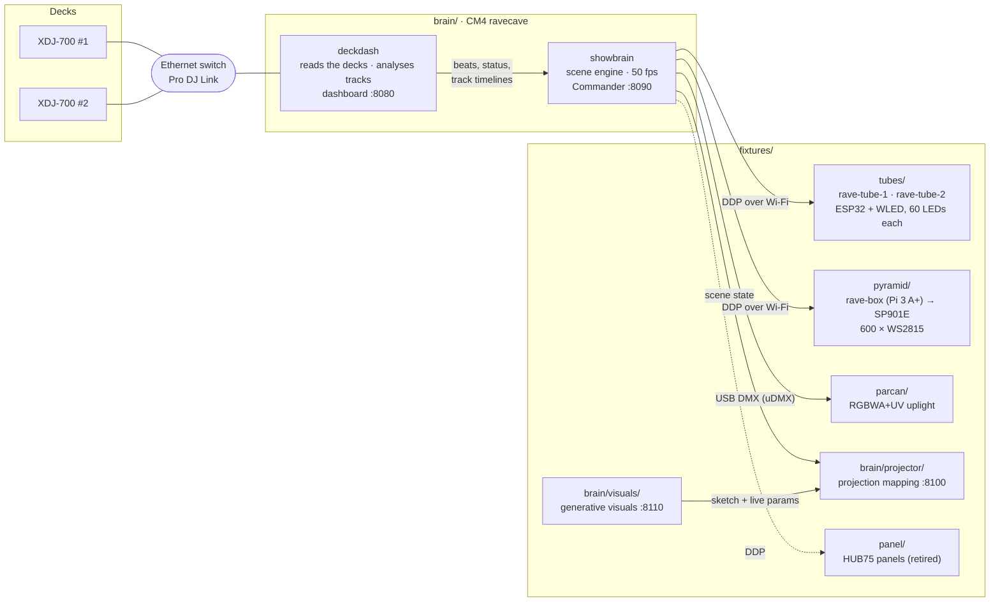

# Rave Cave

A lighting rig driven by the DJ decks. A Raspberry Pi Compute Module 4 (the **brain**) joins the Pioneer DJ Link network, reads what each deck is playing, analyses every loaded track ahead of time to find breakdowns, builds and drops, and drives all the lights (the **fixtures**) from one scene engine.

**Status (27 Sep 2026):** running end to end in the workshop. Two decks drive two LED tubes and a DMX par can. An LED pyramid is wired and taking test patterns, but isn't in the show yet.

## System

Every box in the diagram is a folder in this repo.

## How it works

1. **Reading the decks.** `deckdash` joins the Pro DJ Link network as a virtual player using [beat-link](https://github.com/Deep-Symmetry/beat-link). It receives beat packets and each deck's status (playing, tempo master, BPM, pitch, beat position), and pulls metadata, artwork, beat grids and detailed colour waveforms from the rekordbox USB.
2. **Reading ahead.** When a track loads, `deckdash` measures bass and energy for every bar from the waveform and labels the track: intro, groove, breakdown, build, drop, outro. A drop is where bass comes back strongly after a low-bass stretch, refined to the exact bar.
3. **Scenes.** `showbrain` follows one live deck through GROOVE → BREAKDOWN → BUILD (holds while the DJ loops) → PRE-DROP (blackout on the last beat) → DROP. Everything is timed in beats, so tempo changes and loops are handled. Cueing the other deck doesn't steal the lights; see [docs/show-engine.md](docs/show-engine.md#which-deck-drives-the-lights).
4. **Fixtures.** Each fixture renders its own look for the current scene. LED fixtures get frames over DDP (the protocol WLED uses) on UDP 4048; the par can gets DMX over USB. Per-fixture delays make every light hit the drop together.

## Repository layout

| Folder | What's in it | Docs |
|---|---|---|
| [`brain/`](brain/) | Everything on the CM4 | [docs/brain.md](docs/brain.md) |
| [`brain/deckdash/`](brain/deckdash/) | Java Pro DJ Link client, track timeline analyser, dashboard | [docs/show-engine.md](docs/show-engine.md) |
| [`brain/showbrain/`](brain/showbrain/) | Python scene engine, looks, fixture outputs, Commander, `config.json` | [docs/show-engine.md](docs/show-engine.md) |
| [`brain/provision/`](brain/provision/) | Cloud-init generator for flashing the CM4 | [docs/brain.md](docs/brain.md#build-it-from-scratch) |
| [`brain/system/`](brain/system/) | systemd units, udev rule, journald config | [docs/brain.md](docs/brain.md#3-packages-and-system-config) |
| [`brain/projector/`](brain/projector/) | Projection mapping: output page and editor on :8100 | [docs/fixtures/projector.md](docs/fixtures/projector.md) |
| [`brain/visuals/`](brain/visuals/) | Generative visuals: live-adjustable sketches, control page on :8110 | [docs/visuals.md](docs/visuals.md) |
| [`brain/mixer/`](brain/mixer/) | DJM-450 USB bridge (post-fader levels, master, MIDI) | [docs/show-engine.md](docs/show-engine.md#which-deck-drives-the-lights) |
| [`brain/tools/`](brain/tools/) | Receive-only Pro DJ Link decoder | |
| [`brain/deploy.sh`](brain/deploy.sh) | Push code to the rig and restart services | |
| [`fixtures/tubes/`](fixtures/tubes/) | Floor tube tools (WLED setup, Bluetooth probes) and enclosure CAD | [docs/fixtures/tubes.md](docs/fixtures/tubes.md), [tube-enclosure.md](docs/fixtures/tube-enclosure.md) |
| [`fixtures/pyramid/`](fixtures/pyramid/) | WS2815 receiver and setup for rave-box | [docs/fixtures/pyramid.md](docs/fixtures/pyramid.md) |
| [`fixtures/parcan/`](fixtures/parcan/) | Stand-alone uDMX sender | [docs/fixtures/parcan.md](docs/fixtures/parcan.md) |
| [`fixtures/panel/`](fixtures/panel/) | HUB75 receiver, panel health test, status web UI | [docs/fixtures/panel.md](docs/fixtures/panel.md) |
| [`docs/api.md`](docs/api.md) | Dashboard API reference (for front-end work) | |
| [`docs/`](docs/) | All documentation, plus `history/` (original plan, first panel log) and `manuals/` | |

## Hardware

| Part | Role |
|---|---|
| 2 × Pioneer XDJ-700 (fw 1.13) | Decks, linked through an unmanaged Ethernet switch. No DJM mixer is on the link, so there's no fader data. |
| Raspberry Pi CM4 (4 GB, 32 GB eMMC, Wi-Fi), carrier board, fan | The brain. Ethernet to the decks, Wi-Fi to the fixtures. |
| 2 × 103 cm RGB floor tubes, each with an ESP32 running WLED | `rave-tube-1`, `rave-tube-2` |
| Raspberry Pi 3 A+, SP901E amplifier, 2 × 5 m WS2815 (12 V) | LED pyramid (`rave-box`) |
| Battery RGBWA+UV uplight, anyma uDMX | Par can, 10-channel DMX at address 1 |
| Projector with Chrome | Projection mapping from `brain/projector` (:8100) |
| Pioneer DJM-450 (USB to the brain) | Mixer levels: the lights follow the deck that owns the mix |
| 4 × 32×16 HUB75 panels | Retired (faults on three panels) |

## Running it

- **Dashboard:** `http://ravecave.local:8080`. Live decks, artwork, and XDJ-style stacked scrolling waveforms (one lane per deck, with a phase meter) showing predicted sections and drops. It also has a Serato-style **library**: crates, search, BPM and key filters, and load to deck. See [docs/show-engine.md](docs/show-engine.md#dashboard-waveforms-and-library).
- **Commander:** `http://ravecave.local:8090`. The lighting controller. It has performance pads (beat-synced strobe, blinder, blackout, flash), latched scenes, colour lock or cycle, half- and double-time, per-fixture mute and level, a tap clock for when no deck is playing, a live fixture view, and drop control (DROP NOW, BUILD, HOLD, skip or mark drops). See [docs/show-engine.md](docs/show-engine.md#commander-control-page-on-the-pi).
- **Projection mapping:** `http://ravecave.local:8100/` on the projector, `http://ravecave.local:8100/edit` on your phone to set it up.
- **Generative visuals:** `http://ravecave.local:8110/` to reshape the live sketch; set a surface's content to generative to show it.
- **Deploy changes:** `brain/deploy.sh` (both brain services), or `brain/deploy.sh showbrain | deckdash | mixer | projector | visuals | web | preview | pyramid | panel`.
- **Dashboard preview:** `http://ravecave.local:8080/preview/` for testing page changes against live data. See [docs/brain.md](docs/brain.md#access-for-collaborators).
- **Add a fixture:** add it to [`brain/showbrain/config.json`](brain/showbrain/config.json) (`strip`, `panel` or `dmx_par`) and deploy.

Both brain services start on boot. WLED fixtures fall back to their own idle effect whenever the stream stops.

## Configuration and secrets

Site-specific values (Wi-Fi SSID and password, host overrides) live in a git-ignored `.env` at the repo root. Copy [`.env.example`](.env.example) and fill it in. Scripts and the show config read it; `brain/deploy.sh` copies it to the Pi. Hosts are addressed by `.local` names by default, so no IP addresses are needed in the code.

## Rebuilding the rig

1. **Brain:** flash and set up the CM4 → [docs/brain.md](docs/brain.md).
2. **Decks:** connect both players and the brain's Ethernet to one switch. rekordbox-exported USB in a player.
3. **Tubes:** move each tube's strip to an ESP32 and flash WLED → [docs/fixtures/tubes.md](docs/fixtures/tubes.md).
4. **Par can:** plug the uDMX into the brain, set the light to 10-channel DMX at address 1 → [docs/fixtures/parcan.md](docs/fixtures/parcan.md).
5. **Pyramid:** wire rave-box → SP901E → strips and run its setup → [docs/fixtures/pyramid.md](docs/fixtures/pyramid.md).
6. List the fixtures in `config.json` and run `brain/deploy.sh`.

## Known limitations

- **Drop detection** is waveform-based and tested on a limited number of tracks. It can be up to a bar out, and psytrance produces many candidates. rekordbox phrase analysis would give exact labels. Commander marks fix individual tracks and are logged for calibration.
- **No fader data** without a DJM on the link, so the live deck is chosen by rules.
- **rave-box's Wi-Fi** has dropped several times.
- **The Pi has no RTC**, so its clock is wrong until time syncs after boot.

## Next

Pyramid pixel map and looks, projector visuals synced to the scenes, drop-prediction calibration, and laser and smoke outputs. Smoke will have hardware-enforced off-by-default, burst limits and arming.
