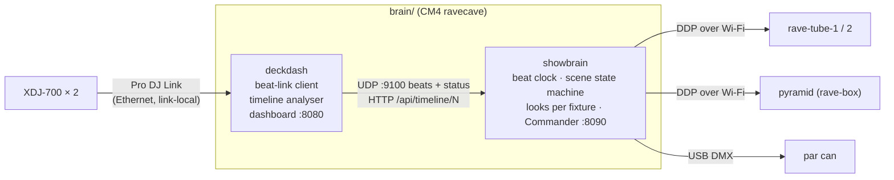

# Show engine: read-ahead lighting from the decks

How the Rave Cave CM4 (`ravecave`) turns Pro DJ Link data from the XDJ-700s into lighting that anticipates the music: it detects drops ahead of time, builds suspense into them, and hits the drop on the beat.

Code: [`brain/deckdash/`](../brain/deckdash/) (deck data, timelines, dashboard) and [`brain/showbrain/`](../brain/showbrain/) (scenes, looks, Commander).

**Status (27 Sep 2026): phases 1-4 running** on `ravecave`:
- `deckdash` (Java, :8080): deck data, the track timeline analyser (`Timeline.java`, `/api/timeline/N`), a dashboard with sections, drops and a countdown on the waveforms, a stacked scrolling two-deck waveform, and a UDP feed to showbrain (127.0.0.1:9100).
- `showbrain` (Python + numpy, :8090 Commander): the scene engine at 50 fps (about 2.5 ms per frame), driving `rave-tube-1`, `rave-tube-2` (flipped role, comet hand-off) over DDP and the par can over USB DMX. Per-track overrides and drop-calibration marks are saved in `overrides.json` on the Pi, not in git.
- Deploy with `brain/deploy.sh`.

Still to do: add the pyramid, tune latency by eye, calibrate drop detection across the library, smoke controller.

## What the decks give us

| Data | Source | Use |
|---|---|---|
| Beat packets: beat-in-bar, BPM, pitch, time to next beat/bar | Broadcast by each player on every beat | The beat clock. Every effect locks to this. |
| Player status: playing, cued, looping, master, sync, beat number | Status packets to our virtual CDJ (#7) | Which deck is live; where it is in the track; detects loops and jumps |
| Beat grid: time of every beat | USB export via CrateDigger | Converts beats to bars and phrases; lets us schedule ahead in beats, not milliseconds |
| **Detailed colour waveform**: 150 frames/s for the whole track, red = bass, green = mids, blue = highs | USB export (.EXT) | **Read-ahead**: bass and energy per bar, so we find breakdowns, builds and drops before they play |
| Hot cues and memory points | USB export | Many DJs mark drops. Treat them as strong hints. |
| rekordbox phrase analysis (Intro / Up / Down / Chorus / Outro) | USB export, **only if analysed** | Best-quality labels. Not present in this library yet (see "Improve the input"). |
| Track metadata and artwork | USB export | Per-track palette (from the artwork or the key), dashboard |

Not available: channel faders and on-air (no DJM on the link). "Live deck" is inferred instead (below).

## Evidence so far

Bar-by-bar bass and energy from the detailed waveform, with bars grouped in 8s (`|`), for the two tracks loaded on 2026-09-26:

```
Five (Original Mix) - Dennis Cruz
energy ▁▁▁▁▁▁▁▁|▆▆▆▆▆▆▆▆|...|█▇▇▇▇▇▇▇|▁▁▁▁▁▁▁▁|▁▁▁▁▁▁▁▁|▁ ▁▂▂▅▇▇|▇▇█▇▇▆█▇|...
bass          |▇▇▇▇▇▇▇▇|...|█▇▇▇▇▇▇▇|▂▂▂▂▂▂▂▁|▁▁▁▁▁▁▁▁|▁ ▁▁▂▄▇▇|▇▇█▇▇▅█▇|...
-> beat-in bar 9 (0:15); breakdown bars 81-100; build 99-104; DROP bar 105 (3:16)

It Feels So Good (Extended Mix) - Sonique, Matt Sassari, Hugel
-> beat-in bar 25 (0:45); DROP bar 57 (1:45); DROP bar 113 (3:30), each after a bass-less breakdown
```

The rule used was: a phrase boundary (every 8 bars) where the next 4 bars carry at least 1.6x the bass of the previous 8. It caught every drop in both tracks, with no false positives. It needs validating across the whole library (285 tracks on the USB).

## Architecture



- **deckdash** is the single owner of the DJ Link connection (only one process can hold the ports).
- **showbrain** is Python for fast iteration on looks. It never talks to the decks directly.
- Each fixture has its own delay (`delay_ms`) so near-instant USB DMX lands with the Wi-Fi fixtures (about 40 ms).

## Track timeline (computed when a track loads)

For each loaded track, build a list of sections in **beats**:

```json
{"track": "Five", "bars": 166, "sections": [
  {"type": "intro",     "startBar": 1,   "endBar": 8},
  {"type": "groove",    "startBar": 9,   "endBar": 80},
  {"type": "breakdown", "startBar": 81,  "endBar": 98},
  {"type": "build",     "startBar": 99,  "endBar": 104},
  {"type": "drop",      "startBar": 105, "endBar": 120, "confidence": 0.9, "source": "waveform"},
  {"type": "groove",    "startBar": 121, "endBar": 158},
  {"type": "outro",     "startBar": 159, "endBar": 166}]}
```

Detection, in priority order:
1. **rekordbox phrases** if present: `Up` means build, `Down` means breakdown, and `Chorus` after `Up`/`Down` means drop (high-mood tracks).
2. **DJ cues**: a hot cue or memory point within a bar of a waveform candidate raises confidence. A cue comment containing "drop" confirms it.
3. **Waveform analysis**: per-bar bass share and energy. A breakdown is a run of at least 4 low-bass bars. The drop is the first phrase boundary (8/16/32 bars) where bass returns strongly. The build is the rising-energy bars before the drop, or at least the last 8 bars of the breakdown.
4. **Beat-in** (first bass after the intro) is its own event type. It gets a smaller hit than a real drop.

Per-track overrides from the Commander ("mark drop here", "not a drop") are saved by rekordbox ID and title, and take precedence next time.

## Which deck drives the lights

No mixer is on the link, so there's no fader data. The live deck is chosen by rules (`Engine.live_deck`):
1. A deck locked in the Commander ("follow deck 1 / 2").
2. Mixer on-air flags, if a Pioneer DJM ever joins the link. This is the closest thing to "fader up".
3. Otherwise, **sticky**: stay on the current deck while it plays. Cueing, previewing or beatmatching the other deck doesn't move the lights, even when tempo master moves.
4. Hand over when the current deck stops or ends, when it has been in its outro for 16 s while the other has played for 30 s, or when the incoming deck hits a predicted drop while the outgoing one is in its outro.

An earlier version followed the tempo master. That jumped to a newly cued deck, so it was replaced.

## Scene flow (state machine)

```
IDLE ──track playing──> GROOVE <──────────────┐
                          │ section=breakdown  │ 8-16 bars after drop
                          v                    │
                       BREAKDOWN               │
                          │ build window opens │
                          v                    │
                        BUILD ──(DJ loops)──> HOLD (stay at current intensity)
                          │ 1 beat before drop │
                          v                    │
                       PRE-DROP (blackout/inhale)
                          │ drop beat (minus output latency)
                          v                    │
                        DROP ──────────────────┘
```

| Scene | Looks (tube and panel) | Timing |
|---|---|---|
| IDLE | WLED's own ambient effect (Pi stops streaming) | No deck playing |
| GROOVE | Pulse on every beat, stronger on beat 1; palette from the artwork or key; comet or chase every bar | Beat-locked |
| BREAKDOWN | Slow breathing, desaturated, around 30% brightness, sparkles on the hi-hats | Bar-locked |
| **BUILD** | Brightness climbs; strobe rate doubles every 2 bars (1/4 → 1/8 → 1/16 → 1/32); fill rises up the tube; colour drifts to white; panel chase accelerates | Intensity = progress through the build window |
| HOLD | Freeze build intensity, keep strobing at the current rate | DJ is looping the build |
| **PRE-DROP** | Near-blackout for the last beat (or half bar) | The "inhale" |
| **DROP** | Full white hit on the drop beat, then 8-16 bars of the high-energy scene (strobe on the beat, saturated palette hits); **smoke burst** if armed | Fires early by the measured output latency |

Robustness:
- **Loops**: never drop while looping. Drop when the loop exits and the playhead crosses the drop beat.
- **Pitch and tempo changes**: schedule in beats, so they're handled automatically.
- **Jumps and hot cues**: a position discontinuity re-evaluates the current section immediately.
- **DJ mixes out before the drop**: if the live deck changes or stops, cancel the build and fade to the new deck's state.
- **Paused / cued**: freeze, then fade to IDLE after about 5 s.

## Timing

- Beat packets carry *time until the next beat and bar*, so showbrain runs a beat clock (a phase-locked loop) and schedules effects ahead of time.
- **Output latency** (Wi-Fi plus WLED buffering, likely 20-60 ms) is measured once per output and subtracted, so drops land on the kick. Measure with a slow-motion phone video of the deck's beat counter next to the tube, or a tap test in the Commander.
- DDP frames at 60 fps. WLED's realtime mode falls back to its own effect if the stream stops, so the lights never freeze.

## Commander (control page on the Pi)

A second tab on the dashboard, built for a phone:
- Live timeline strip over the waveform: sections coloured, predicted drops marked, playhead, and a **"DROP in 12 beats"** countdown.
- **AUTO / MANUAL**, **follow deck: auto / 1 / 2**.
- Momentary buttons: **DROP NOW**, **BUILD** (start a build immediately, N bars), **HOLD**, **BLACKOUT**, **STROBE**.
- **Skip this drop**, **Mark drop here** (saved as a per-track override).
- Master intensity and palette.
- **Smoke: ARM / DISARM**, with the burst length shown and the cooldown remaining.

## Smoke safety (non-negotiable)

- Relay defaults **off** at boot and when commands stop (heartbeat timeout).
- Hard cap per burst (e.g. 3 s) and a minimum cooldown (e.g. 60 s), enforced **on the smoke controller itself**, not just in showbrain.
- Must be **armed** in the Commander. Auto drops only fire smoke while armed.
- Respect venue rules and detectors.

## Build phases

| # | Deliverable | Done when |
|---|---|---|
| 1 | **Beat clock + latency**: showbrain pulses the tube on the live deck's beats, with latency compensation | Tube pulses land on the kick by eye at 120-130 BPM |
| 2 | **Timeline analyser** in deckdash, `/api/timeline/N`, sections and drop markers on the dashboard waveform | Predicted drops match by ear on 20+ tracks from the USB |
| 3 | **Scene engine**: GROOVE / BREAKDOWN / BUILD / PRE-DROP / DROP on the tube | Cue a track 16 bars before a drop and it builds and hits on the beat |
| 4 | **Commander**: manual controls, deck follow, overrides, background pre-analysis of the whole USB library | The DJ can override anything from a phone; the next track's drops are known before it loads |
| 5 | **More fixtures**: tubes, par can (done); pyramid, stage strips, laser (DMX), smoke with the interlocks above (to do) | All outputs follow the same scene engine |
| 6 | **Rehearsal**: full set, log every scene decision, tune thresholds | A full set with no missed or false drops that matter |

## Improve the input (free)

In rekordbox: **Preferences > Analysis > Track Analysis Setting**, enable **Phrase**, re-analyse the library and re-export to the USB. That adds Intro / Up / Down / Chorus / Outro labels at exact beats. The waveform analyser stays as the fallback for anything not phrase-analysed.

## Open questions

- Pyramid pixel map (shape, edge lengths, strip route) and pyramid looks.
- Mixer: which DJM, and does it have a LINK port? On-air data would replace the live-deck rules.
- Smoke machine: DMX or switched mains? Which relay or controller?
- The rig network for shows: a dedicated travel router, so home, workshop and venue look identical.
